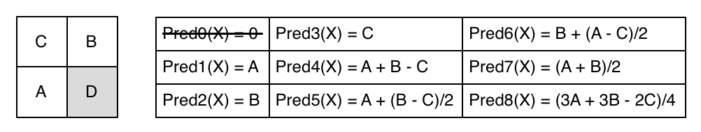

# ImageCodec

This is the final project of Video Signal Processing in NTHU, 2015, Spring, and the document is just a set of supplementary materials. It simply demonstrates how to use these source files to encode/decode an image, and how to integrate/compile the project. Because it is complex, I can only show how to use as clearly as possible. If you have any problem, please send me an e-mail. (tony123930@yahoo.com.tw)

## Requirements
- Mac OSX [**recommended**] or UNIX (terminal and shell script used)
- Xcode-build-tools [**recommended**] or g++ compiler
- Matlab [**recommended**] or YUV viewer


	Note that Windows has not been tested yet, so it might take lots of time encoding an image. Please wait for it, thanks. <br/>
	If you are trying to run this project on the platform other than Mac OSX, please make sure your executable (.out, .exe) is in the directory `/ImageCodec/`

## Project Structure
- Root: `/ImageCodec/`
- Code: `/ImageCodec/code/`, `/ImageCodec/libs/`
- Data: `/ImageCodec/data/`
- Generated: `/ImageCodec/results/`
- Report: `/ImageCodec/report/`

	Note that if user does not arrange files followed the structure mentioned above, it might cause some unknown errors.

## Quick Start

### Directly running the sample code

- run `cd ~/{YOUR_DIR}/ImageCodec/`

- Configuration in the sample code
	1. check the file `/ImageCodec/code/ImageCodec_Demo.cpp`

		```c++
		#define CONSTRAINT_BY_PSNR 0
		#define CONSTRAINT_BY_BITRATE 1
		#define SKIP_ENCODING -1

		using namespace std;
		int main(int argc, const char * argv[]) {

			int constWay = {Config}; // 
								<-- can be
								CONSTRAINT_BY_PSNR    : Use PSNR as constraint
								CONSTRAINT_BY_BITRATE : Use bitrate as constraint
								SKIP_ENCODING         : Skip encoding

			int opt = {Config}; // <-- can be
											0: 1_1536x1024.yuv
											1: 2_1024x768.yuv
											2: 3_1000x728.yuv
											3: 4_1000x1504.yuv
		```
		
		and
		
		```c++
			if (constWay == CONSTRAINT_BY_PSNR) {
				ss << PATHS[opt+4]; ss << "bitstream1.bin";
				ImageCodec::encodeTo(ss.str())->withImage(img)->withMinPSNR({Config})->run();
				ss.str(""); ss.clear(); ss << PATHS[opt+4]; ss << "bitstream2.bin";
				ImageCodec::encodeTo(ss.str())->withImage(img)->withMinPSNR({Config})->run();
				ss.str(""); ss.clear(); ss << PATHS[opt+4]; ss << "bitstream3.bin";
				ImageCodec::encodeTo(ss.str())->withImage(img)->withMinPSNR({Config})->run();
			} else if (constWay == CONSTRAINT_BY_BITRATE) {
				ss << PATHS[opt+4]; ss << "bitstream1.bin";
				ImageCodec::encodeTo(ss.str())->withImage(img)->withMaxBitrate({Config})->run();
				ss.str(""); ss.clear(); ss << PATHS[opt+4]; ss << "bitstream2.bin";
				ImageCodec::encodeTo(ss.str())->withImage(img)->withMaxBitrate({Config})->run();
				ss.str(""); ss.clear(); ss << PATHS[opt+4]; ss << "bitstream3.bin";
				ImageCodec::encodeTo(ss.str())->withImage(img)->withMaxBitrate({Config})->run();
			}
		```
			
	2. Replace the annotation `{Config}` with your specific configurations.

	3. run `./run.sh` under `/ImageCodec/`

- Do the following commands on the terminal
	1. run `chmod +x ./run.sh`
	2. key in your pwd
	3. run `./run.sh`

- Use Matlab code to convert YUV to PNG
	- run `genImage` under `/ImageCodec/` on Matlab terminal

- Check the output files in `/ImageCodec/results/`

### Encoding an image

- This API gives 2 ways to encode an image.

1. Specific upper bound of bitrate

	```c++
	YUVImage* img = YUVImage::import({image_path})
							->withFormat({image_format})
							->withSize({image_width}, {image_height});
	PerformancePackage::load(img->getName());
	ImageCodec::encodeTo({target_path})->withImage(img)->withMaxBitrate({max_bitrate})->run();
	```

	e.g.

	```c++
	YUVImage* img = YUVImage::import("./1_1536x1024.yuv")
							->withFormat(YUVImage::FORMAT_4_2_0)
							->withSize(1536, 1024);
	PerformancePackage::load(img->getName());
	ImageCodec::encodeTo("./bitstream.bin")->withImage(img)->withMaxBitrate(0.75)->run();
	PerformancePackage::save();
	```

2. Specific lower bound of PSNR

	```c++
	YUVImage* img = YUVImage::import({image_path})
							->withFormat({image_format})
							->withSize({image_width}, {image_height});
	PerformancePackage::load(img->getName());
	ImageCodec::encodeTo({target_path})->withImage(img)->withMinPSNR({min_PSNR})->run();
	PerformancePackage::save();
	```

	e.g.

	```c++
	YUVImage* img = YUVImage::import("./1_1536x1024.yuv")
							->withFormat(YUVImage::FORMAT_4_2_0)
							->withSize(1536, 1024);
	PerformancePackage::load(img->getName());
	ImageCodec::encodeTo("./bitstream.bin")->withImage(img)->withMinPSNR(28)->run();
	PerformancePackage::save();
	```
	
### Decoding an image

- Decoding a compressed file is easy.

	```c++
	ImageCodec::decode({bitstream_path})->saveTo({target_path})->run();
	```
	e.g.
	
	```c++
	ImageCodec::decode("./bitstream.bin")->saveTo("./decompressed.yuv")->run();
	```

### Obtaining PSNR

- Importing 2 images and then call the following API.

	```c++
	double PSNR = img1->calPSNR(img2);
	```
	
	e.g.
	
	```c++
	YUVImage* img1 = YUVImage::import("./1_1536x1024.yuv")
							->withFormat(YUVImage::FORMAT_4_2_0)
							->withSize(1536, 1024);
	YUVImage* img2 = YUVImage::import("./decompressed.yuv")
							->withFormat(YUVImage::FORMAT_4_2_0)
							->withSize(1536, 1024);
	double PSNR = img1->calPSNR(img2);
	```

### Obtaining Bitrate

- Importing the original image, and then give the path of compressed file.

	```c++
	double bitrate = img->calBitrate({bitstream_path});
	```	
	
	e.g.
	
	```c++
	YUVImage* img = YUVImage::import("./1_1536x1024.yuv")
							->withFormat(YUVImage::FORMAT_4_2_0)
							->withSize(1536, 1024);
	double bitrate = img->calBitrate("./bitstream.bin");
	```

## Coding System

- Level 1: main coding system.


- Level 2: optionally applied, for compensating PSNR.


## Work Flow


1. Define the searching space. ( O(dsr x mk x pid x qres), very large! )
2. Use all parameters to encode the file.
3. Evaluate the bitrate and PSNR.
4. Submit the result to `ParameterPackage`
5. Find the best parameters set under specific constraint.

## Bitstream Format (top-bottom, left-right)


## Solution of slow parameters searching
To save the time re-searching same parameters at same image, an database/controller has been programmed for saving these parameters. It is `/ImageCodec/libs/PerformancePackage.h`:

- the parameters will be saved in `/ImageCodec/libs/PerformancePackageCache/`, that's why this project should be runned at the appropriate directory. (to avoid some potential problems)

- the database is programmed as singleton, which can be identified with 'name'. In this project, the parameters are stored in the database named from `YUVImage::getName()`

	i.e.
	
	```c++
	YUVImage* image = YUVImage::import(mImgPath)
									->withSize(mWidth, mHeight)
									->withFormat(YUVImage::FORMAT_4_2_0);
	PerformancePackage::load(image->getName());
	```

## APIs List (only description and partial usage so far)

### ImageCodec.h (642)
- Main component of this project: to encode/decode a file.

	- Encoding
	
		```c++
		ImageCodec::encodeTo({target_path})
					->withImage({your_image})
					->withMaxBitrate({max_bitrate})
					->run();
		```
	
		```c++
		ImageCodec::encodeTo({target_path})
					->withImage({your_image})
					->withMinPSNR({min_PSNR})
					->run();
		```
		
	- Decoding
	
		```c++
		ImageCodec::decode({bitstream_path})
					->saveTo({decompressed_path})
					->run();
		```

### YUVImage.h (520)
- An object that contains lots of functions/properties that an image has.

	- Importing an image
	
		```c++
		YUVImage* image = 
				YUVImage::import({image_path})
						->withSize({image_width}, {image_height})
						->withFormat(YUVImage::FORMAT_4_2_0);
		```
		
	- Initiate an empty image
	
		```c++
		YUVImage* image = YUVImage::emptyImage({assigned_path}, 
												{image_width}, 
												{image_height}, 
												{image_format});
		```
		
	- Save the image into a file

		```c++
		image->exportTo({tartget_path});
		```
		
	- Properties

		```c++
		image->getWidth(DataLayer::Y); image->getHeight(DataLayer::Cr);
		image->getDataSize(DataLayer::Cb);
		image->getDataSize(); // get total size of image
		image->getFormat(); // FORMAT_4_2_0 | FORMAT_4_2_2 | FORMAT_4_4_4
		image->getPath();
		image->getName();
		```
		
	- Data getters & setters

		```c++
		image->getYDataAt<int>(x, y);
		image->getCbDataAt<short>(x, y);
		image->getCrDataAt<long>(x, y);
		image->setYDataAt(x, y, (short)v);
		image->setCbDataAt(x, y, (short)v);
		image->setCrDataAt(x, y, (short)v);
		```
		
	- Circular Addition/Subtraction

		```c++
		YUVImage* image3 = image1->add(image2);
		YUVImage* image4 = image1->diff(image2);
		```
		
	- Evaluate difference between two images

		```c++
		double PSNR = image1->calPSNR(image2);
		```
		
	- Evaluate the compressed bitrate

		```c++
		double bitrate = image1->calBitrate({bitstream_path});
		```

<!--
| type | return | name | parameters | description |
|:-----|:--------|:--------|:------|:-------|
| static | YUVImage* | emptyImage | string path, int width, <br/> int height, int format |
| dynamic | YUVImage* | transformToFormat | YUVImage::FORMAT\_4\_2\_0 \| <br/> YUVImage::FORMAT\_4\_2\_2 \| <br/> YUVImage::FORMAT\_4\_4\_4 |
| dynamic | YUVImage* | add | YUVImage* image | circular addition |
| dynamic | YUVImage* | diff | YUVImage* image | circular subtraction |
| dynamic | int | getWidth | DataLayer::Y \| <br/> DataLayer::Cb \| <br/> DataLayer::Cr | width of Y/U/V layer |
| dynamic | int | getHeight | DataLayer::Y \| <br/> DataLayer::Cb \| <br/> DataLayer::Cr | height of Y/U/V layer |
| dynamic | int | getDataSize | DataLayer::Y \| <br/> DataLayer::Cb \| <br/> DataLayer::Cr | area of Y/U/V layer |
| dynamic | T | getYDataAt\<T\> | int x, int y | the value at the position (x, y) in Y layer |
| dynamic | T | getCbDataAt\<T\> | int x, int y | the value at the position (x, y) in U layer |
| dynamic | T | getCrDataAt\<T\> | int x, int y | the value at the position (x, y) in V layer |
-->

### YUVImageFactory.h (150)
- A toolbox to process `YUVImage`: to apply k-means clustering.

	- Clustering the image

		```c++
		YUVImageFactory* factory = 
					YUVImageFactory::initWithImage(image)
										->useQuantization()
										->withYUVLevels({Y_clusters}, {U_clusters}, {V_clusters})
										->compress();
		```
		
	- After clustering, all data in the image refer to cluster ID rather than magnitude. The clustered image with cluster ID can be obtained with `YUVImage* symbolImg = factory->getSymbolImage()`, and the clustered image with magnitude can be obtained with `YUVImage* clusteredImg = factory->getImage()`

	- Information after clustering

		```c++
		factory->getYLevel(); // get # of Y_clusters
		factory->getYSymbolAt(n); // get the n^th center of Y
		factory->getULevel(); factory->getUSymbolAt(n);
		factory->getVLevel(); factory->getVSymbolAt(n);
		```

### ImagePredictor.h (139)
- A toolbox to process `YUVImage`: to generate predicted residual image with a specific predictor ID.

	- Directly getting a residual image
	
		```c++
		YUVImage* resImg = ImagePredictor::predictResidual(image, predictorID);
		```
		
	- Use circular subtraction (e.g. 1 cirSubtr_5 7 = (1-7) % 5 = 4)

		```c++
		int circularN[3] = {64, 16, 8};
		YUVImage* resImg = ImagePredictor::predictResidual(image, predictorID, circularN);
		```
	
	- Predictor ID: (only 1-8 used)

		

### Transform.h (65)
- A toolbox to do discrete cosine transform: 4x4-block supported so far. [***not used***]

	- Transformation of a vector

		```c++
		int v1[4] = {1, -1, 2, -2};
		Transform::dct4<int>(v1);
		
		short v2[4] = {11, 1, -2, 1};
		Transform::idct4<short>(v2);
		```
		
	- Transformation of multiple vectors

		```c++
		int v1[12] = {1, 2, 1, 2, -1, 3, 15, 10, 0, 2, -3, -5};
		Transform::dct4<int>(v1, 3);
		
		long v2[8] = {1254, -4, 11, 19, 28, 3, 2, 0};
		Transform::idct4<long>(v2, 2);
		```

### KmeansFactory.h (176)
- A toolbox to do k-means clustering.

	- `KmeansFactory<T>`: all data are stored in T type.
	- `KmeansInfo<T, centerT>`: all centers are stored in centerT type.

	```c++
	int data[65536] = {1, 4, 2, 8, 10, 16, ... };
	KmeansFactory<int>* factory = KmeansFactory<int>::getInstance();
	KmeansInfo<int, int>* info = factory->withRawData(data, 65536)
										->clusterInto(4096)
										->run<int>();
	```

### HuffmanTable.h (298)
- An object able to construct a canonical Huffman table with specific contents data.

	- `HuffmanTable<T>`: all data are stored in T type.

	```c++
	char data[1024] = {0, 5, 123, ... };
	HuffmanTable<short>* table = HuffmanTable::initWithSize(256)
												->withData(data, 1024);
	```
	
	- Get maximal word length and entries value

		```c++
		int WL_max = table->getMaxWordLength();
		for (int i = 0; i < WL_max; i++)
			int nEntries = table->getNumEntriesWithWordLength(i+1);
		```
		
	- Get symbol/probability at specific index

		```c++
		Symbol<T>* symb = table->getSymbolAt(n);
		double p = table->getProbabilityAt(n);
		```

### GolombRiceTable.h (213)
- An object able to construct a Golomb-Rice table. [***not used***]

	- `GolombRiceTable<T>`: all data are stored in T type

	```c++
	GolombRiceTable<int>* table = GolombRiceTable<int>::initWithSize({size})
														->withGroupSize({group_size})
														->init();
	```

	- Other getters are similar to HuffmanTable's.

### PerformancePackage.h (316)
- A central controller/database to manage the efficiency and its corresponded parameters set.

	- Getting database with a specific name
	
		```c++
		PerformancePackage* pkg = PerformancePackage::getInstance(name);
		```
	
	- Submitting a 'tried parameters set' to database

		```c++
		CompressionParameters* 
				cp = Builder()->withArea(imageArea)
							  ->withDownSampleScale(wscale, hscale)
							  ->withMk_YUV(mk_y, mk_u, mk_v)
							  ->withPredictorID(predictorID)
							  ->withKmeansTableSize(N_k)
							  ->withMk_TABLE(mk_table)
							  ->withMaxWordLength(WL_max)
							  ->withKmeansTableBitrate(kmeansTableBitrate)
							  ->withAdjustBitrate(adjustBitrate)
							  ->withResidualQuantizationConst(Q_res)
							  ->withPSNR(PSNR)
							  ->withAdjust(isWithAdjust);
		pkg->submit(cp);
		```
	
	- After searching all parameters, the database should eliminate some higher-bitrate and lower-PSNR (higher cost, lower efficiency) parameters set.

		```c++
		pkg->anneal();
		```
		
	- Save all data into the disk

		```c++
		PerformancePackage::save();
		```
	
	- Load data with a specific name

		```c++
		PerformancePackage::load(name);
		```

### BitReader.h (93)
- A toolbox to read a file in bits level.

	- Opening an input stream
	
		```c++
		BitReader* reader = BitReader::open({stream_path});
		```
		
	- Reading data (big endian)

		```c++
		char v = reader->read(); // read a bit
		char* v = reader->read(size);
		long v = reader->read<long>(15); // read 15 bits and store in long
		short v = reader->read<short>(3);
		```
	
	- Properties

		```c++
		int restBits = reader->remains();
		int size = reader->getFileSize(); // in terms of bits not bytes
		```
		
	- DO NOT FORGET TO CLOSE INPUT STREAM! (because it is singleton.)

		```c++
		reader->close();
		```

### BitWriter.h (101)
- A toolbox to write a file in bits level.

	- Opening the output stream
	
		```c++
		BitWriter* writer = BitWriter::open({stream_path});
		```
		
	- Writing data

		```c++
		writer->write(0);
		
		char v[5] = {0, 1, 1, 1, 0};
		writer->write(v, 5);
		
		int k = 18;
		writer->write<int>(k, 7); // write '0010010'
		```
		
	- DO NOT FORGET TO CLOSE OUTPUT STREAM! (because it is singleton.)

		```c++
		writer->close();
		```

### Symbol.h (77)
- An object that contains lots of functions/properties that a symbol has.

	- `Symbol<T>`: the value of the symbol is stored in T type

	- Getters
	
		```c++
		Symbol<short>* s = new Symbol<short>(v);
		short value = s->getValue();
		std::vector<char> word = s->getWord();
		string wordStr = s->getWordString();
		int wordCount = s->getWordSize();
		```
		
### Total: 2790 lines